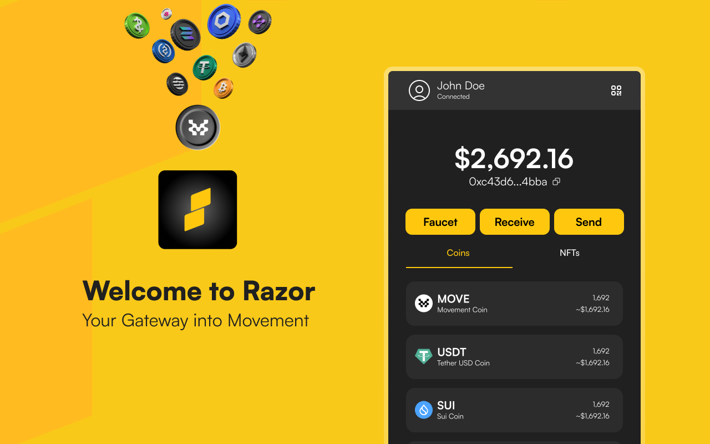

# New to Movement? Install your wallet

Currently, Mosaic supports [Razor Wallet](https://razorwallet.xyz/) and [Nightly Wallet](https://nightly.app/), 2 wallets for Movement Network. All transactions on Mosaic are securely executed through Web3 Wallets, allowing you to fully leverage Mosaic's on-chain features without compromising your privacy.

<figure><figcaption></figcaption></figure>

<figure><figcaption></figcaption></figure>

